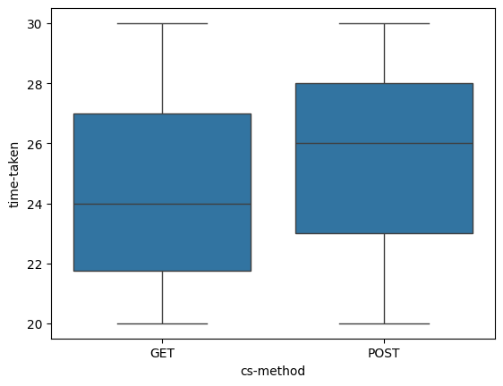
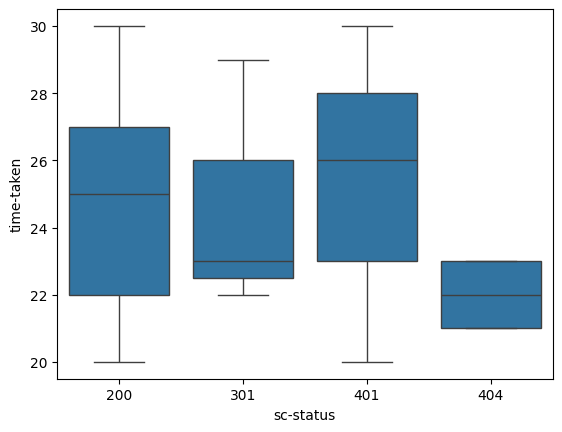
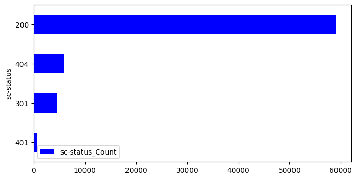
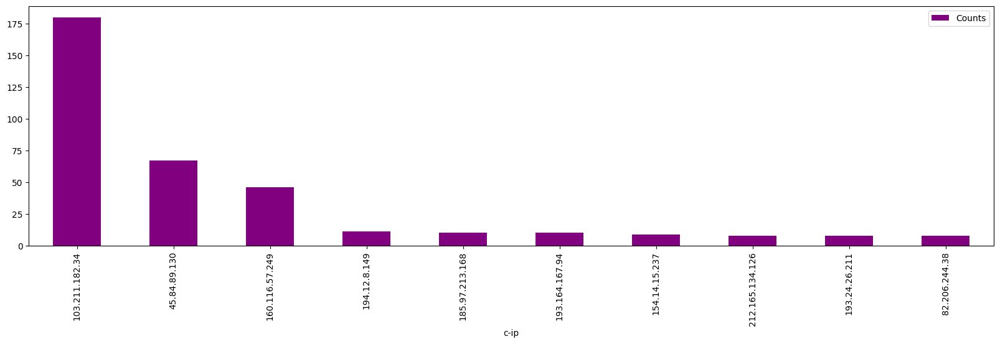
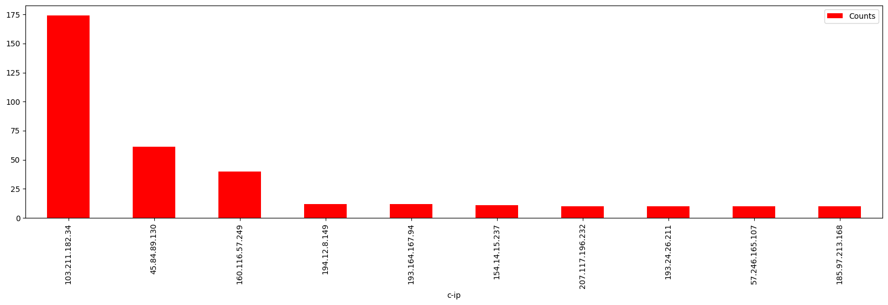
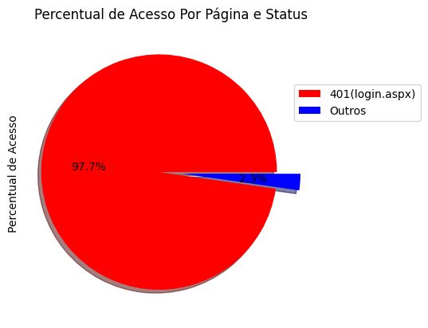
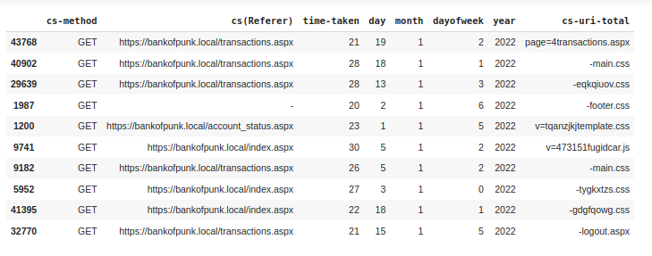
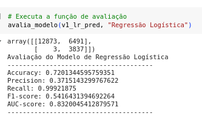
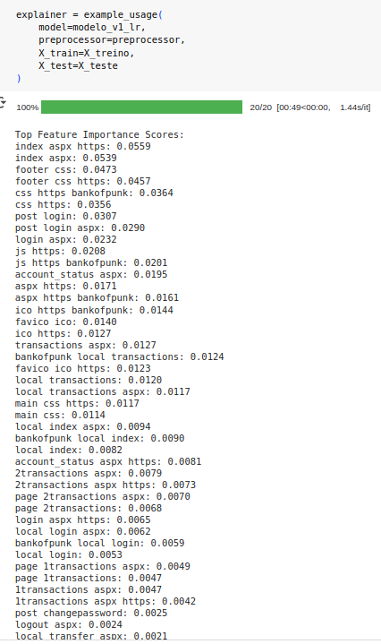

# Cyber Security Project: Suspicious IPs and Machine Learning Modeling

Here's the data dictionary for the given features of the dataset:

1. `date`: The date of the event.
2. `time`: The time of the event.
3. `s-ip`: The source IP address.
4. `cs-method`: The HTTP request method (e.g., GET, POST).
5. `cs-uri-stem`: The URI stem of the requested resource.
6. `cs-uri-query`: The query string portion of the URI.
7. `s-port`: The source port number.
8. `cs-username`: The username associated with the request (if applicable).
9. `c-ip`: The client IP address.
10. `cs(User-Agent)`: The user-agent string of the client's browser or application.
11. `cs(Referer)`: The referer URL, indicating the page that referred the client to the current page.
12. `sc-status`: The HTTP status code returned by the server.
13. `sc-substatus`: The HTTP substatus code.
14. `sc-win32-status`: The Windows status code.
15. `time-taken`: The time taken to process the request.


## Time-taken by the request by HTTP request method



## Time-taken by the request by the HTTP status code returned by the server



## Horizontal bar plot of the HTTP status code returned by the server



## Brute force login attempts



### Analysis Results:

The figure above shows three IP addresses that had the largest number of request by the **POST** method. 
This clearly indicates brute force login attempt in order to obtain the username and/or password. 

## time...



### Analysis of the Results:

The high volume of request access via **POST** arises from three IP addresses. 
And the requests are redirected to **login.aspx** web page.
This indicates that the page is trying to be accessed until the access credentials are found. 
Clearly, this demonstrates an **brute force login attempt**.

## Percentage of Access by page and status



The figure above clearly shows that the login url is the most accessed page.

## Machine Learning Modeling

A machine learning problem using the provided dataset, which appears to be web server log data, can be performed as follows.

**Problem Statement**:
Predict whether a web server request will result in a successful response (e.g., HTTP status code 200) or an unsuccessful response (e.g., HTTP status code 400 or higher).

**Features**:
1. **Date and Time**: Extract day of the week, hour of the day, etc., from the timestamp.
2. **Source IP Address (s-ip)**: One-hot encoded categorical variable representing the source IP address.
3. **Client IP Address (c-ip)**: One-hot encoded categorical variable representing the client IP address.
4. **Request Method (cs-method)**: One-hot encoded categorical variable representing the HTTP request method (e.g., GET, POST).
5. **Request URI Stem (cs-uri-stem)**: One-hot encoded categorical variable representing the requested URI stem.
6. **Request URI Query (cs-uri-query)**: One-hot encoded categorical variable representing the requested URI query.
7. **Source Port (s-port)**: One-hot encoded categorical variable representing the source port.
8. **User-Agent String (cs(User-Agent))**: One-hot encoded categorical variable representing the user-agent string of the client's browser or application.
9. **Referer URL (cs(Referer))**: One-hot encoded categorical variable representing the referer URL.
10. **Time Taken (time-taken)**: Numerical variable representing the time taken to process the request.

**Target Variable**:
- **Response Status (sc-status)**: Binary variable indicating whether the server response was successful (e.g., 1 for HTTP status code 200) or unsuccessful (e.g., 0 for HTTP status code 400 or higher).

**ML Approach**:
This problem can be framed as a binary classification task, where the goal is to predict whether a web server request will result in a successful response or not based on the provided features.

With this setup, you can apply various **machine learning algorithms** such as logistic regression, random forest, or gradient boosting classifiers to predict the target variable based on the extracted features. 
The model can be trained and evaluated using standard techniques, such as cross-validation and performance metrics like accuracy, precision, recall, and F1-score. 
Additionally, you can explore techniques for feature selection, hyperparameter tuning, and model interpretation to improve the model's performance and interpretability.

### Text and Numeric Preprocessing Pipelines Documentation
Version: 1.0
Last Updated: January 18, 2025

#### Overview
This document outlines the design and implementation of a robust preprocessing system that handles both text and numeric features in machine learning pipelines. The system is built using scikit-learn's Pipeline and ColumnTransformer components, providing a scalable and maintainable solution for feature engineering.

#### Architecture

##### Core Components
1. Text Pipeline
2. Numeric Pipeline
3. Combined Preprocessor

#### Detailed Component Specifications

##### Text Pipeline

###### Purpose
Transforms multiple text columns into a unified TF-IDF representation while handling various edge cases and data quality issues.

###### Key Features
- Robust text concatenation with error handling
- N-gram support (unigrams and bigrams)
- Automated removal of high and low frequency terms
- Unicode accent stripping
- Missing value handling

###### Implementation Details
```python
text_pipeline = Pipeline([
    ('concatenate', FunctionTransformer(concatenate_text_columns)),
    ('tfidf', TfidfVectorizer(
        stop_words='english',
        min_df=2,
        max_df=0.95,
        ngram_range=(1, 2)
    ))
])
```

###### Design Decisions
1. **Concatenation Strategy**:
   - Uses space-based joining instead of other delimiters
   - Implements safe type conversion to handle mixed data types
   - Strips whitespace to prevent token artifacts

2. **TF-IDF Parameters**:
   - min_df=2: Removes rare terms that appear in < 2 documents
   - max_df=0.95: Removes overused terms appearing in > 95% of documents
   - ngram_range=(1, 2): Captures phrase patterns while maintaining computational efficiency

##### Numeric Pipeline

###### Purpose
Standardizes numeric features while handling missing values and outliers.

###### Key Features
- Median-based missing value imputation
- Robust Scaler normalization, which is proper for data with outliers
- Automatic handling of sparse data

###### Implementation Details
```python
numeric_pipeline = Pipeline([
    ('imputer', FunctionTransformer(handle_numeric_missing)),
    ('scaler', RobustScaler())
])
```

###### Design Decisions
1. **Imputation Strategy**:
   - Uses median instead of mean to handle skewed distributions
   - Performs imputation before scaling to prevent data leakage
   - Maintains column-wise statistics for consistent transformation

2. **Scaling Approach**:
   - Implements robust scaler normalization for compatibility with various ML algorithms
   - Handles outliers through Quantiles

#### Combined Preprocessor

##### Architecture Benefits
1. **Modularity**: Each pipeline can be modified independently
2. **Maintainability**: Clear separation of concerns between text and numeric processing
3. **Scalability**: Easy to add new features or modify existing transformations
4. **Reproducibility**: Consistent application of transformations across training and test sets

##### Usage Guidelines

###### Training Phase
```python
preprocessor = create_preprocessor(text_columns, numeric_columns)
X_train_transformed = preprocessor.fit_transform(X_train)
```

###### Inference Phase
```python
X_test_transformed = preprocessor.transform(X_test)
```

##### Best Practices
1. **Data Validation**:
   - Verify column names and types before processing
   - Check for unexpected missing value patterns
   - Monitor frequency distributions of text features

2. **Performance Optimization**:
   - Use sparse matrices for text features when possible
   - Monitor memory usage with large datasets
   - Consider batch processing for very large datasets

3. **Model Integration**:
   - Include preprocessor in the full model pipeline
   - Use cross-validation to prevent data leakage
   - Save fitted preprocessor with model artifacts

#### Error Handling and Edge Cases

##### Text Processing
- Handles NULL values gracefully
- Manages mixed data types through safe conversion
- Processes malformed Unicode characters
- Handles empty strings and whitespace

##### Numeric Processing
- Deals with infinity values
- Manages string values in numeric columns
- Handles missing value patterns
- Processes outliers effectively

#### Performance Considerations

##### Memory Usage
- Text pipeline may create sparse matrices
- Numeric pipeline maintains dense arrays
- Combined preprocessor optimizes memory based on data characteristics

##### Computational Efficiency
- Vectorized operations for numeric processing
- Efficient text concatenation using filtered joins
- Optimized TF-IDF computation with sparse matrices

#### Conclusion
This preprocessing system provides a robust, maintainable, and efficient solution for handling both text and numeric features in machine learning pipelines. 
Its modular design allows for easy modifications and extensions while maintaining high performance and reliability.

## Data before text-processing

In the figure below it is shown a snapshot of the data before text-processing, which is necessary in order to perfom machine learning modeling.



## Machine Learning Modeling

Below is shown the `Logistic Regression` modeling results of the text and numerical data, showing an overall good performance, demonstrated by the *AUC* value of 0.83. 
By using more complex models, such as *Random Forest* did not provide better results, instead it yielded a high overfitting in the test data.



## Explainable AI (XAI) for text-processed data

Below is shown the most relevant features in the text-processed data modeling using `Logistic Regression` algorithm, which were obtained and ranked through **SHAP** values.




# Contributor Covenant Code of Conduct

## Our Pledge

We as members, contributors, and leaders pledge to make participation in our
community a harassment-free experience for everyone, regardless of age, body
size, visible or invisible disability, ethnicity, sex characteristics, gender
identity and expression, level of experience, education, socio-economic status,
nationality, personal appearance, race, caste, color, religion, or sexual
identity and orientation.

We pledge to act and interact in ways that contribute to an open, welcoming,
diverse, inclusive, and healthy community.

## Our Standards

Examples of behavior that contributes to a positive environment for our
community include:

* Demonstrating empathy and kindness toward other contributions that are not aligned with this Code of Conduct, and will communicate reasons for moderation decisions when appropriate.

## Scope

This Code of Conduct applies within all community spaces, and also applies when
an individual, or aggression toward or disparagement of classes of individuals.

**Consequence**: A permanent ban from any sort of public interaction within the
community.

## Attribution

This Code of Conduct is adapted from the [Contributor Covenant][homepage],
version 2.1, available at
[https://www.contributor-covenant.org/version/2/1/code_of_conduct.html][v2.1].

Community Impact Guidelines were inspired by
[Mozilla's code of conduct enforcement ladder][Mozilla CoC].

For answers to common questions about this code of conduct, see the FAQ at
[https://www.contributor-covenant.org/faq][FAQ]. Translations are available at
[https://www.contributor-covenant.org/translations][translations].

[homepage]: https://www.contributor-covenant.org
[v2.1]: https://www.contributor-covenant.org/version/2/1/code_of_conduct.html
[Mozilla CoC]: https://github.com/mozilla/diversity
[FAQ]: https://www.contributor-covenant.org/faq
[translations]: https://www.contributor-covenant.org/translations is officially representing the community in public spaces.
Examples of representing our community include using an official e-mail address,
posting via an official social media account, or acting as an appointed
representative at an online or offline event.

## Enforcement

Instances of abusive, harassing, or otherwise unacceptable behavior may be
reported to the community leaders responsible for enforcement at
[INSERT CONTACT METHOD].
All complaints will be reviewed and investigated promptly and fairly.

All community leaders are obligated to respect the privacy and security of the
reporter of any incident.

## Enforcement Guidelines

Community leaders will follow these Community Impact Guidelines in determining
the consequences for any action they deem in violation of this Code of Conduct:

### 1. Correction

**Community Impact**: Use of inappropriate language or other behavior deemed
unprofessional or unwelcome in the community.

**Consequence**: A private, written warning from community leaders, providing
clarity around the nature of the violation and an explanation of why the
behavior was inappropriate. A public apology may be requested.

### 2. Warning

**Community Impact**: A violation through a single incident or series of
actions.

**Consequence**: A warning with consequences for continued behavior. No
interaction with the people involved, including unsolicited interaction with
those enforcing the Code of Conduct, for a specified period of time. This
includes avoiding interactions in community spaces as well as external channels
like social media. Violating these terms may lead to a temporary or permanent
ban.

### 3. Temporary Ban

**Community Impact**: A serious violation of community standards, including
sustained inappropriate behavior.

**Consequence**: A temporary ban from any sort of interaction or public
communication with the community for a specified period of time. No public or
private interaction with the people involved, including unsolicited interaction
with those enforcing the Code of Conduct, is allowed during this period.
Violating these terms may lead to a permanent ban.

### 4. Permanent Ban

**Community Impact**: Demonstrating a pattern of violation of community
standards, including sustained inappropriate behavior, harassment of an
individual people
* Being respectful of differing opinions, viewpoints, and experiences
* Giving and gracefully accepting constructive feedback
* Accepting responsibility and apologizing to those affected by our mistakes,
  and learning from the experience
* Focusing on what is best not just for us as individuals, but for the overall
  community

Examples of unacceptable behavior include:

* The use of sexualized language or imagery, and sexual attention or advances of
  any kind
* Trolling, insulting or derogatory comments, and personal or political attacks
* Public or private harassment
* Publishing others' private information, such as a physical or email address,
  without their explicit permission
* Other conduct which could reasonably be considered inappropriate in a
  professional setting

## Enforcement Responsibilities

Community leaders are responsible for clarifying and enforcing our standards of
acceptable behavior and will take appropriate and fair corrective action in
response to any behavior that they deem inappropriate, threatening, offensive,
or harmful.

Community leaders have the right and responsibility to remove, edit, or reject
comments, commits, code, wiki edits, issues, and other